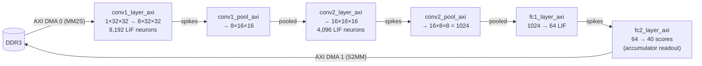
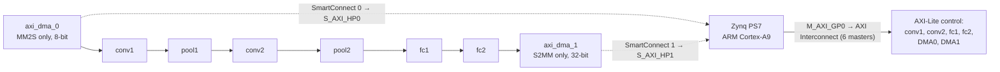

# SpikeFace

**A Hardware-Efficient, Event-Driven Spiking Neural Network Accelerator for Real-Time Edge Facial Recognition on the PYNQ-Z2 FPGA**

-blue)


-informational)


> **Status: under active development.** The full HLS datapath is implemented and verified bit-exact in C-simulation, and a complete block design with a generated bitstream is committed. On-board validation, the PYNQ runtime driver and the benchmarking study are still in progress.

---

## Table of Contents

1. [Aim](#1-aim)
2. [Repository Structure](#2-repository-structure)
3. [Codebase Explanation (Block-wise)](#3-codebase-explanation-block-wise)
4. [Setup and Configuration (Vitis HLS and Vivado)](#4-setup-and-configuration-vitis-hls-and-vivado)

---

## 1. Aim

### 1.1 Problem

Facial recognition on edge devices forces a trade-off between recognition accuracy, inference latency and power. Conventional CNN accelerators use dense, frame-synchronous computation: every multiply-accumulate (MAC) is performed whether or not the input carries information.

### 1.2 Objective

**SpikeFace** is a Spiking Neural Network (SNN) accelerator that performs computation **only when spike events occur**. It exploits the sparsity and temporal dynamics of spike-based coding to cut redundant arithmetic, memory accesses and dynamic power. It targets real-time face recognition on a resource-constrained **Xilinx PYNQ-Z2 (Zynq-7000 XC7Z020)** using a hardware–software co-design:

| Partition | Responsibility |
|---|---|
| **Processing System (PS)**, ARM Cortex-A9 | System control, image acquisition, spike encoding, layer orchestration, host communication |
| **Programmable Logic (PL)** | The neuromorphic datapath: event-gated convolution, pooling, fully-connected layers and readout |

The design will be benchmarked against software (CPU/GPU) and FPGA-based CNN implementations on latency, throughput, resource utilisation (LUT/BRAM/DSP), power, energy per inference and accuracy.

### 1.3 Key features

- **Event-gated MAC.** A tap is multiplied and accumulated only when its input is non-zero. Measured skipped taps on the golden data are **51.0 % (conv1), 54.5 % (conv2) and 66.3 % (fc1)**, growing deeper into the network.
- **Leaky Integrate-and-Fire (LIF) neurons** in 8-bit fixed point (weights Q1.7, membrane Q3.5), bit-accurate to the Python quantised reference.
- **Time-multiplexed neuron core** reused across all neurons of a layer, so a 12 k-neuron network fits on a Zynq-7020.
- **AXI-Stream dataflow** between layers, with AXI-Lite for parameters and control and AXI DMA to DDR at the ends.
- **Bit-exact verification** of every layer against golden vectors exported from the Python model.

### 1.4 Current status

| Area | Status |
|---|---|
| Fixed-point types, LIF neuron, event-gated MAC | Done, verified against golden vectors |
| conv1 → pool1 → conv2 → pool2 → fc1 → fc2 (plain-array + AXI versions) | Done, C-simulation bit-exact |
| HLS synthesis and IP export for all six blocks | Done (IP output is git-ignored; rebuild per [§4](#4-setup-and-configuration-vitis-hls-and-vivado)) |
| Vivado block design, bitstream, XSA | Done, committed (`spikeface/`) |
| On-board validation, PYNQ driver, benchmarking | In progress |

---

## 2. Repository Structure

```text
spikeface/                                   <- repository root
├── .gitignore                               Ignores HLS solution dirs and Vivado run/cache/project files
│
├── Spikeface_HLS/                           Vitis HLS sources, testbenches, golden data
│   │
│   │  ── Numeric foundation ─────────────────────────────────────────────
│   ├── spikeface_types.h                    Core fixed-point types (weight_t, spike_t, mem_t, acc_t)
│   ├── conv2_types.h                        pooled_t (5-level pooled activation)
│   ├── lif_neuron.h                         event_gated_mac25() + lif_update()
│   ├── spikeface_neuron_top.h               spikeface_neuron_step(): 1 neuron, 1 timestep
│   │
│   │  ── Layer blocks (plain-array reference + AXI top for each) ────────
│   ├── conv1_layer.h / .cpp                 conv1 reference   (conv1_layer_step)
│   ├── conv1_layer_axi.h / .cpp             conv1 AXI IP top  (conv1_layer_axi)
│   ├── conv1_pool.h / .cpp                  pool1 reference   (conv1_pool_step)
│   ├── conv1_pool_axi.h / .cpp              pool1 AXI IP top  (conv1_pool_axi)
│   ├── conv2_layer.h / .cpp                 conv2 reference   (conv2_layer_step)
│   ├── conv2_layer_axi.h / .cpp             conv2 AXI IP top  (conv2_layer_axi)
│   ├── conv2_pool.h / .cpp                  pool2 reference   (conv2_pool_step)
│   ├── conv2_pool_axi.h / .cpp              pool2 AXI IP top  (conv2_pool_axi)
│   ├── fc1_layer.h / .cpp                   fc1 reference     (fc1_layer_step)
│   ├── fc1_layer_axi.h / .cpp               fc1 AXI IP top    (fc1_layer_axi)
│   ├── fc2_layer_axi.h / .cpp               fc2 readout AXI IP top (fc2_layer_axi)
│   │
│   │  ── Testbenches (C-simulation) ─────────────────────────────────────
│   ├── tb_spikeface_neuron.cpp              Single neuron
│   ├── tb_conv1_array.cpp / _axi.cpp        conv1 full layer
│   ├── tb_conv1_pool.cpp / _axi.cpp         pool1
│   ├── tb_conv2_array.cpp / _axi.cpp        conv2 full layer
│   ├── tb_conv2_pool.cpp / _axi.cpp         pool2
│   ├── tb_fc1_layer.cpp / _axi.cpp          fc1
│   ├── tb_fc2_layer_axi.cpp                 fc2 readout (values + TLAST)
│   │
│   │  ── Golden vectors (auto-generated from the Python reference, ~10 MB) ─
│   ├── golden_vectors.h                     Single conv1 neuron (T=20)
│   ├── golden_conv1_array.h                 conv1 input, kernels, spikes, active taps
│   ├── golden_pool.h                        pool1 input / output
│   ├── golden_conv2.h                       conv2 weights, input, spikes, active taps
│   ├── golden_pool2.h                       pool2 input / output
│   ├── golden_fc1.h                         fc1 weights, input, spikes, active taps
│   ├── golden_fc2.h                         fc2 weights, input, class scores
│   │
│   │  ── Project metadata ───────────────────────────────────────────────
│   ├── README.md                            Legacy fc1 checkpoint note
│   ├── hls.app, .project, .cproject,        Vitis HLS / Eclipse project files
│   │   .settings/, .apc/                    (machine-specific absolute paths inside)
│   └── .vitis_hls_log_all.xml               Vitis HLS log dump
│
└── spikeface/                               Vivado 2022.2 project (source-control form)
    ├── rebuild_vivado.tcl                   Recreates the project and the `system_top` block design
    ├── system_150926.xsa                    Pre-built hardware handoff (bitstream + .hwh + HLS drivers)
    └── spikeface.srcs/sources_1/bd/system_top/
        ├── system_top.bd                    Block design
        ├── system_top.bda, ui/              Block design metadata / layout
        └── ip/*/*.xci                       Configuration of each IP instance
```

### Naming conventions

| Pattern | Meaning |
|---|---|
| `<block>_layer.{h,cpp}` / `<block>_pool.{h,cpp}` | **Plain-array reference** (`*_step` functions). Verified first, used as the golden model for the AXI version. |
| `<block>_layer_axi.{h,cpp}` / `<block>_pool_axi.{h,cpp}` | **Synthesizable IP top** with AXI-Stream, AXI-Lite and `static` internal state. Computation is unchanged from the reference; only the interface differs. |
| `tb_<block>*.cpp` | C-simulation testbench (prints `PASS`/`FAIL`, mismatch counts and measured sparsity). |
| `golden_*.h` | Vectors exported bit-exact from the Python fixed-point model. Regenerate only from the Python reference. |
| `conv1_*` / `conv2_*` | Layer position in the network. `conv2_pool*` is the pooling *after* conv2, feeding fc1. |

### Where do I look to…

| I want to… | Open |
|---|---|
| Understand the numeric formats and why they were chosen | `spikeface_types.h`, `conv2_types.h`, top of `fc2_layer_axi.h` |
| See how a spiking neuron works in hardware | `lif_neuron.h`, `spikeface_neuron_top.h` |
| See what the synthesized IP for a layer looks like | `<block>_layer_axi.cpp` (interface pragmas at the top) |
| Change conv2 or fc1 parallelism | `CONV2_IC_GROUP` in `conv2_layer.h`, `FC1_GROUP` in `fc1_layer.h` |
| Check a layer against the reference | matching `tb_*.cpp` and `golden_*.h` |
| See how the blocks are wired together | `spikeface/rebuild_vivado.tcl` (search for `connect_bd_intf_net`) |
| Load the design on the board without rebuilding | `spikeface/system_150926.xsa` |

---

## 3. Codebase Explanation (Block-wise)

### 3.0 System overview

The network processes **T timesteps** per image. In each timestep a binary 32×32 spike frame (rate-coded from the face image) flows through the pipeline. Membrane potentials persist inside each layer between timesteps, and the readout layer accumulates evidence across all timesteps.



| Stage | Input | Output | Neurons / units | Weights |
|---|---|---|---|---|
| conv1 | 1×32×32 spikes | 8×32×32 spikes | 8,192 LIF | 8×5×5 = 200 |
| pool1 | 8×32×32 spikes | 8×16×16 pooled | none (2×2 average) | none |
| conv2 | 8×16×16 pooled | 16×16×16 spikes | 4,096 LIF | 16×8×5×5 = 3,200 |
| pool2 | 16×16×16 spikes | 16×8×8 pooled (1,024) | none | none |
| fc1 | 1,024 pooled | 64 spikes | 64 LIF | 64×1,024 = 65,536 |
| fc2 | 64 spikes | 40 scores | 40 accumulators (no LIF) | 40×64 = 2,560 |

The 40 outputs correspond to the 40 identities of the ORL (AT&T) face dataset. The class with the highest accumulated score after the last timestep is the prediction.

---

### Block 1: Numeric foundation
**Files:** `spikeface_types.h`, `conv2_types.h`, and the extra types at the top of `fc2_layer_axi.h`

Every layer shares one set of fixed-point types, chosen from a quantisation sweep (8-bit matched float32 accuracy while using about 12 % of the PYNQ-Z2 BRAM budget).

| Type | Definition | Used for |
|---|---|---|
| `weight_t` | `ap_fixed<8,1>` (Q1.7) | conv1, conv2, fc1 weights |
| `spike_t` | `ap_uint<1>` | Spikes: a true single bit, so "multiply by spike" becomes a free conditional accumulate |
| `pooled_t` | `ap_ufixed<3,1>` | Pooled activations; represents exactly {0, 0.25, 0.5, 0.75, 1.0} |
| `mem_t` | `ap_fixed<8,3,AP_RND_CONV,AP_SAT>` (Q3.5) | Membrane potential, leak factor β, threshold θ |
| `acc_t` | `ap_fixed<20,8,AP_RND_CONV,AP_SAT>` | MAC accumulator (wider than `mem_t` to avoid intermediate overflow) |
| `weight_fc2_t` | `ap_fixed<8,2>` (Q2.6) | fc2 weights (range up to ±1.48 needs 2 integer bits) |
| `axis_score_t` / `score_packet_t` | `ap_fixed<32,8,…>` / `ap_axiu<32,0,0,0>` | DMA-legal 32-bit score stream with an explicit `TLAST` |

**Bugs found and fixed while building these types (documented in the source comments):**

- `spike_t` was originally `ap_fixed<8,1>`, which cannot hold `1.0` (it wraps to −1.0) and flips the sign of every affected MAC term. It is now `ap_uint<1>`.
- `AP_RND` (round-half-up) differs from Python's `torch.round` (round-half-to-even). `AP_RND_CONV` matches. The mismatch appears only at array scale, never in single-neuron tests.
- fc2 weights silently wrapped when cast to `weight_t`, so a dedicated `weight_fc2_t` (Q2.6) is used.
- AXI DMA requires stream widths of 8/16/32/… bits. The 20-bit `acc_t` is therefore widened to 32 bits only at the output stream port.

---

### Block 2: LIF neuron and event-gated MAC
**Files:** `lif_neuron.h`, `spikeface_neuron_top.h`

| Function | Role |
|---|---|
| `event_gated_mac25()` | 25-tap (5×5) MAC. A tap is accumulated **only if its input is non-zero**, and the count of active taps is returned for sparsity reporting. This is the "event-driven" claim in hardware. |
| `lif_update()` | One LIF step: `mem = β·mem + I`, quantise to `mem_t`, fire if `mem ≥ θ`, reset to zero on fire. |
| `spikeface_neuron_step()` | Composes the two for one neuron and one timestep. `PIPELINE II=1` (without it synthesis gave Latency 29 / Interval 30 and the full array would be too slow). |

Parameters used in the golden data: **β = 0.9375, θ = 1.0**.

---

### Block 3: conv1 (spiking convolution)
**Files:** `conv1_layer.{h,cpp}` (reference), `conv1_layer_axi.{h,cpp}` (IP top: `conv1_layer_axi`)

- 1 input channel (32×32 binary frame) → 8 output channels of 32×32 (5×5 kernels, padding 2) = **8,192 neurons**.
- A **single neuron core is time-multiplexed** over all 8,192 neurons (one replica would already use ~8 % of the chip's LUTs, so physical replication is infeasible). Loops `CH → ROW → COL` are pipelined at II=1.
- Kernel weights are read once per channel and reused spatially. The zero-padded input is built once per timestep and shared by all channels.
- Membrane state is a `static mem_t mem_state[8][32][32]` inside the IP (BRAM), so it persists across timesteps and is **not** part of the interface.
- **Interface:** `input_frame` / `spike_out` on AXI-Stream; `weights`, `beta`, `threshold`, `total_active_taps` and the control registers on AXI-Lite (`s_axi_CTRL`).
- `conv1_layer.cpp` is only an include stub because `conv1_layer_step` is defined in its header.

### Block 4: pool1 (2×2 average pooling)
**Files:** `conv1_pool.{h,cpp}`, `conv1_pool_axi.{h,cpp}` (IP top: `conv1_pool_axi`)

- Pure spatial down-sampling of 8×32×32 spikes → 8×16×16 `pooled_t`. **No LIF, no threshold, no state.** Matches Python `F.avg_pool2d(spk, 2)`.
- Pooling needs four values at once but a stream delivers one per read, so the frame is buffered first. The buffer is partitioned cyclically (factor 2 in both spatial dimensions) into 4 banks so all four reads occur in one cycle and II=1 is achieved.
- Interface: two AXI-Streams and `ap_ctrl_hs`. In the block design its `ap_start` is tied to a constant `1`, so it runs freely.

### Block 5: conv2
**Files:** `conv2_layer.{h,cpp}` (reference), `conv2_layer_axi.{h,cpp}` (IP top: `conv2_layer_axi`)

- 8×16×16 pooled input → 16×16×16 spikes (5×5×8 = **200 taps per neuron**, 4,096 neurons).
- Unlike conv1, inputs are multi-level (`pooled_t`), so each tap needs a real multiplier. The `CONV2_IC_GROUP` macro (in `conv2_layer.h`) sets how many of the 8 input channels are processed per cycle:

  | `CONV2_IC_GROUP` | Outcome (from synthesis notes in the source) |
  |---|---|
  | 8 (fully parallel) | ~201 DSP / ~118 K LUT, does not fit XC7Z020 |
  | 4 | Negative slack (−6.98 ns at a 10 ns target) |
  | **1 (used)** | Timing-clean; DSP 26/220, LUT 9,368/53,200; ~1.03 M cycles per timestep, the slowest block in the pipeline |

- Same AXI pattern as conv1 (`static` membrane state, weights/`beta`/`threshold` on AXI-Lite).

### Block 6: pool2
**Files:** `conv2_pool.{h,cpp}`, `conv2_pool_axi.{h,cpp}` (IP top: `conv2_pool_axi`)

Identical structure to pool1, resized: 16×16×16 spikes → 16×8×8 `pooled_t`. The output is already in the flat channel-major/row-major order that fc1 expects, so no reordering is needed.

### Block 7: fc1 (dense spiking layer)
**Files:** `fc1_layer.{h,cpp}` (reference), `fc1_layer_axi.{h,cpp}` (IP top: `fc1_layer_axi`)

- 1,024 pooled inputs → 64 LIF neurons (every input connects to every neuron; no patches, no padding).
- `FC1_GROUP = 1` (one input per cycle), chosen up-front from the conv2 lesson because a fully parallel 1,024-tap fan-in would be far beyond budget. It is still faster overall than conv2 because it has only 64 neurons.
- Highest event sparsity in the network (66.3 %).

### Block 8: fc2 (readout)
**Files:** `fc2_layer_axi.{h,cpp}` (IP top: `fc2_layer_axi`; no plain-array version)

- 64 input spikes → **40 class scores**. It has **no LIF, no threshold and no spike**: it accumulates weighted votes across all timesteps.
- `clear_accum` (AXI-Lite): the PS asserts it on the **first timestep of each image** to zero the accumulator; it stays low afterwards. The running total is streamed out on every call, and only the value after the last timestep is the final result.
- Output is `ap_axiu<32,0,0,0>` with **`TLAST` asserted on the 40th score**, so each timestep is exactly one DMA S2MM transfer.
- MAC runs **one tap per cycle**, not because of DSP cost (a spike input makes the multiply free) but because `weights` sits on AXI-Lite, which has a single read port. The accumulate is written as an unconditional add of a masked value to remove a small timing violation (−0.21 ns) caused by the conditional-enable logic.

---

### Block 9: Verification (testbenches and golden vectors)

**Method:** the Python model produces `golden_*.h`. Each testbench feeds the same inputs to the C++ design and compares against the golden outputs. The plain-array reference is verified first; the AXI version is then required to give **identical** results, which proves the interface wrapping changed nothing.

| Testbench | Design under test | Golden data | Pass criterion |
|---|---|---|---|
| `tb_spikeface_neuron.cpp` | `spikeface_neuron_step` | `golden_vectors.h` | 20 timesteps, spikes identical |
| `tb_conv1_array.cpp` | `conv1_layer_step` | `golden_conv1_array.h` | 8×32×32×20 spikes identical |
| `tb_conv1_array_axi.cpp` | `conv1_layer_axi` | `golden_conv1_array.h` | Same, plus `static` state persists across calls |
| `tb_conv1_pool.cpp` / `_axi.cpp` | `conv1_pool_axi` (\*) | `golden_pool.h` | Abs. error ≤ 1e-9 |
| `tb_conv2_array.cpp` / `_axi.cpp` | `conv2_layer_axi` (\*) | `golden_conv2.h` | All spikes identical |
| `tb_conv2_pool.cpp` | `conv2_pool_step` | `golden_pool2.h` | Abs. error ≤ 1e-9 |
| `tb_conv2_pool_axi.cpp` | `conv2_pool_axi` | `golden_pool2.h` | Same |
| `tb_fc1_layer.cpp` | `fc1_layer_step` | `golden_fc1.h` | 64×20 spikes identical |
| `tb_fc1_layer_axi.cpp` | `fc1_layer_axi` | `golden_fc1.h` | Same |
| `tb_fc2_layer_axi.cpp` | `fc2_layer_axi` | `golden_fc2.h` | Scores within 1e-6, argmax equal, `TLAST` on exactly the 40th beat |

(\*) The `_axi` and non-`_axi` testbench files for conv1-pool and conv2-array currently contain identical code that exercises the AXI version.

**Measured event-gating sparsity** (fraction of possible MAC taps skipped, 20 timesteps of golden data):

| Layer | conv1 | conv2 | fc1 |
|---|---|---|---|
| Taps skipped | 51.0 % | 54.5 % | 66.3 % |

---

### Block 10: System integration (Vivado block design `system_top`)
**Files:** `spikeface/rebuild_vivado.tcl`, `spikeface/spikeface.srcs/…/system_top.bd`, `spikeface/system_150926.xsa`



- **PS7:** FCLK0 enabled (**50 MHz** in the current design), `S_AXI_HP0` and `S_AXI_HP1` enabled for DMA access to DDR.
- **DMAs:** simple mode (no scatter-gather). `axi_dma_0` is MM2S-only with an 8-bit stream feeding conv1; `axi_dma_1` is S2MM-only receiving fc2's 32-bit score packets.
- **Layer-to-layer links** are direct AXI-Stream connections.
- **Free-running blocks:** `conv1_pool_axi` and `conv2_pool_axi` have `ap_start` tied to a constant `1` (`xlconstant_0`). The four other layers are started by the PS over AXI-Lite each timestep.
- **No XDC constraints are needed.** The design uses only PS-dedicated pins (DDR, FIXED_IO).

**AXI-Lite address map**

| Instance | Base address | Notable registers (offset from base) |
|---|---|---|
| `conv1_layer_axi_0` | `0x4000_0000` | `beta` 0x10, `threshold` 0x18, `total_active_taps` 0x20, `weights` 0x100–0x1FF |
| `conv2_layer_axi_0` | `0x4001_0000` | same scalars, `weights` 0x1000–0x1FFF |
| `fc1_layer_axi_0` | `0x4002_0000` | same scalars, `weights` 0x10000–0x1FFFF |
| `fc2_layer_axi_0` | `0x4003_0000` | `clear_accum` 0x10, `weights` 0x1000–0x1FFF |
| `axi_dma_0` / `axi_dma_1` | `0x41E0_0000` / `0x41E1_0000` | standard AXI DMA register map |

Offsets are taken from the generated HLS drivers inside the XSA. `0x00` is `AP_CTRL` for every HLS block.

---

### Design lessons captured in the code

1. **Type discipline is critical.** Signed/unsigned and rounding-mode mismatches pass single-neuron tests and fail at array scale.
2. **Time-multiplex, don't replicate.** Real multipliers only exist where inputs are multi-level (conv2, fc1). Spike-input layers (conv1, fc2) reduce to conditional accumulates.
3. **Read the memory ports, not just the arithmetic.** fc2's parallelism was limited by the single AXI-Lite read port on `weights`, not by DSPs.
4. **Check timing slack as carefully as resources.** More parallelism costs combinational depth, not just area.
5. **Verify each stage before the next**, using the same golden vectors for the reference and the AXI version.

---

## 4. Setup and Configuration (Vitis HLS and Vivado)

> **Important:** the exported HLS IP (`Spikeface_HLS/solution*/`, `Spikeface_HLS/solnfc*/`) and the Vivado project files (`*.xpr`, `*.runs`, `*.cache`, …) are **git-ignored**. After cloning you must (1) regenerate the six IPs in Vitis HLS, then (2) rebuild the Vivado project from `rebuild_vivado.tcl`. If you only want the bitstream, skip to [§4.5](#45-quick-path-use-the-pre-built-hardware).

### 4.1 Prerequisites

| Item | Requirement |
|---|---|
| Vitis HLS | **2022.2** (the design and the Tcl are 2022.2) |
| Vivado | **2022.2**, with Zynq-7000 device support (`xc7z020clg400-1`) |
| OS | Linux recommended (the project metadata was created on Linux) |
| Board | PYNQ-Z2 (only for on-board testing; not needed for HLS or Vivado) |
| Git | any recent version |

Use the **same tool version (2022.2)** for HLS and Vivado. Exported IPs and generated drivers are version-sensitive.

### 4.2 Clone the repository

```bash
git clone https://github.com/chidellapranav/spikeface.git
cd spikeface
```

### 4.3 Vitis HLS: build the six IP blocks

#### Settings common to every block

| Setting | Value |
|---|---|
| Part | `xc7z020clg400-1` |
| Clock period | `10 ns` (100 MHz target) |
| Flow target | Vivado IP flow |
| Export format | **IP Catalog** (`Package`); keep the default vendor `xilinx.com`, library `hls`, version `1.0` |

The block design looks the IPs up by these exact names (`xilinx.com:hls:<top>:1.0`), so do not change them.

#### What to add for each block

Add **only the AXI `.cpp`** as the design source (headers are found through the include path) and **exactly one testbench**. A second testbench causes a duplicate `main()` error.

| IP block | Top function | Design source | Testbench | Solution name expected by `rebuild_vivado.tcl` |
|---|---|---|---|---|
| conv1 | `conv1_layer_axi` | `conv1_layer_axi.cpp` | `tb_conv1_array_axi.cpp` | `solution1` |
| pool1 | `conv1_pool_axi` | `conv1_pool_axi.cpp` | `tb_conv1_pool_axi.cpp` | `solution2` |
| conv2 | `conv2_layer_axi` | `conv2_layer_axi.cpp` | `tb_conv2_array_axi.cpp` | `solution3` |
| pool2 | `conv2_pool_axi` | `conv2_pool_axi.cpp` | `tb_conv2_pool_axi.cpp` | `solution4` |
| fc1 | `fc1_layer_axi` | `fc1_layer_axi.cpp` | `tb_fc1_layer_axi.cpp` | `solnfc1` |
| fc2 | `fc2_layer_axi` | `fc2_layer_axi.cpp` | `tb_fc2_layer_axi.cpp` | `solnfc2` |

The Vivado script needs six folders named `Spikeface_HLS/{solution1,solution2,solution3,solution4,solnfc1,solnfc2}/impl/ip`. The mapping of `solution1–4` to the conv/pool blocks above is a suggested convention. Any assignment works as long as each folder holds one of the four IPs.

#### Option A: scripted flow (recommended)

Save as `build_hls_ips.tcl` in the repository root and run `vitis_hls -f build_hls_ips.tcl`. It builds each block in its own project under `hls_build/`, runs C-simulation, synthesis and IP export, then copies each packaged IP to the location `rebuild_vivado.tcl` expects.

```tcl
set src    [file normalize Spikeface_HLS]
set part   xc7z020clg400-1
set period 10

# { top_function  solution_name  testbench  design_source }
set blocks {
  {conv1_layer_axi solution1 tb_conv1_array_axi.cpp conv1_layer_axi.cpp}
  {conv1_pool_axi  solution2 tb_conv1_pool_axi.cpp  conv1_pool_axi.cpp}
  {conv2_layer_axi solution3 tb_conv2_array_axi.cpp conv2_layer_axi.cpp}
  {conv2_pool_axi  solution4 tb_conv2_pool_axi.cpp  conv2_pool_axi.cpp}
  {fc1_layer_axi   solnfc1   tb_fc1_layer_axi.cpp   fc1_layer_axi.cpp}
  {fc2_layer_axi   solnfc2   tb_fc2_layer_axi.cpp   fc2_layer_axi.cpp}
}

foreach blk $blocks {
  lassign $blk top sol tb srcfile

  open_project -reset hls_build/$top
  set_top $top
  add_files     $src/$srcfile -cflags "-I$src"
  add_files -tb $src/$tb      -cflags "-I$src -Wno-unknown-pragmas"

  open_solution -reset -flow_target vivado sol
  set_part $part
  create_clock -period $period -name default

  csim_design                              ;# must print PASS
  csynth_design
  # cosim_design -rtl verilog              ;# optional, slow
  export_design -format ip_catalog

  # Place the IP where rebuild_vivado.tcl looks for it
  file mkdir $src/$sol/impl
  file copy -force hls_build/$top/sol/impl/ip $src/$sol/impl/
  close_project
}
exit
```

#### Option B: GUI flow (repeat for each row of the table)

1. **File → New Project**. Enter the project name, then **Add/Select Files**: add the design source `.cpp` and set the **Top Function**.
2. On the testbench page add **one** testbench `.cpp`. The `golden_*.h` it includes is found automatically because it sits in the same folder.
3. Select the part `xc7z020clg400-1`, period `10` ns, flow target **Vivado IP**.
4. If headers are not found, add the `Spikeface_HLS` folder under **Project Settings → Simulation / Synthesis → CFLAGS** as `-I <path>`. For the testbench also add `-Wno-unknown-pragmas`.
5. Run **C Simulation** (expect `PASS: … bit-exact …`), then **C Synthesis**, then optionally **Co-Simulation**.
6. **Export RTL** with format **Vivado IP (.zip / IP Catalog)**. This creates `<solution>/impl/ip`.
7. Make sure the six `impl/ip` folders end up under `Spikeface_HLS/` with the names in the table above (or edit the paths in `rebuild_vivado.tcl`, see below).

> If you keep the IPs elsewhere, edit the two places in `spikeface/rebuild_vivado.tcl` that list `Spikeface_HLS/solution*/impl/ip` and `solnfc*/impl/ip`. These are the `checkRequiredFiles` list and the `ip_repo_paths` property.

#### Expected result

Six `impl/ip` directories, each containing a `component.xml`. In simulation, every testbench should print a `PASS` line and `0` mismatches.

### 4.4 Vivado: rebuild the block design and generate the bitstream

Run from a scratch directory so the tracked files in `spikeface/` are not overwritten (add `build/` to `.gitignore`).

```bash
mkdir -p build && cd build
vivado -mode batch -source ../spikeface/rebuild_vivado.tcl -tclargs --origin_dir ..
```

This creates `build/spikeface/spikeface.xpr` for part `xc7z020clg400-1` with the `system_top` block design (PS7, 2 AXI DMAs, 6 HLS IPs, interconnect, SmartConnects, reset block) and its HDL wrapper as top.

**GUI equivalent:** open Vivado and, in the Tcl Console, run:

```tcl
cd <path-to-repo>/build
set ::origin_dir_loc ..
source ../spikeface/rebuild_vivado.tcl
```

(`rebuild_vivado.tcl` reads `origin_dir_loc` if it is set; otherwise it assumes `origin_dir` is the current directory.)

Then generate the bitstream and hardware handoff, from the GUI (**Generate Bitstream**, then **File → Export → Export Hardware**, *Include bitstream*) or in batch:

```tcl
open_project build/spikeface/spikeface.xpr
launch_runs synth_1 -jobs 4
wait_on_run synth_1
launch_runs impl_1 -to_step write_bitstream -jobs 4
wait_on_run impl_1
write_hw_platform -fixed -include_bit -force build/spikeface.xsa
```

After implementation check **Reports → Utilization, Timing Summary and Power**.

### 4.5 Quick path: use the pre-built hardware

`spikeface/system_150926.xsa` already contains the bitstream, the hardware description (`.hwh`) and the HLS-generated C drivers.

```bash
unzip spikeface/system_150926.xsa -d xsa_out
```

**For PYNQ:** copy the `.bit` and `.hwh` to the board with the **same base name** (PYNQ pairs them by name), then load the overlay:

```bash
cp xsa_out/system_150926.bit spikeface.bit
cp xsa_out/system_top.hwh    spikeface.hwh
```

```python
from pynq import Overlay
ol = Overlay("spikeface.bit")
print(ol.ip_dict.keys())     # conv1_layer_axi_0, conv2_layer_axi_0, fc1_layer_axi_0, fc2_layer_axi_0, axi_dma_0, axi_dma_1, ...
```

The end-to-end PYNQ driver (weight loading, spike encoding, timestep loop) is under development.

### 4.6 Troubleshooting

| Symptom | Cause / fix |
|---|---|
| Vivado: *"The following IPs are not found in the IP Catalog"* | One of the six HLS IPs is missing or exported to the wrong path. Check the six `impl/ip` folders and their names. |
| csim: duplicate `main()` | More than one testbench in the project. Keep exactly one. |
| csim/synthesis cannot find `../src/…` or a header | The sources are in a flat folder. Use `-I <path to Spikeface_HLS>` and do not assume `src/` or `source/` sub-folders. |
| Testbench passes for one neuron but fails on the full array | Check `mem_t` uses `AP_RND_CONV` and `spike_t` is `ap_uint<1>` (see Block 1). |
| Synthesis reports *II violation: resource limitation* | A memory has too few ports for the parallel reads. See the array-partition comments in `conv1_pool*.cpp` and the single-read-port note in `fc2_layer_axi.cpp`. |
| DMA S2MM never completes | The score stream needs `TLAST`. Re-export `fc2_layer_axi` from the current source (`ap_axiu` output). |
| Part `xc7z020clg400-1` not found | Install Zynq-7000 device support through the Xilinx installer. |
